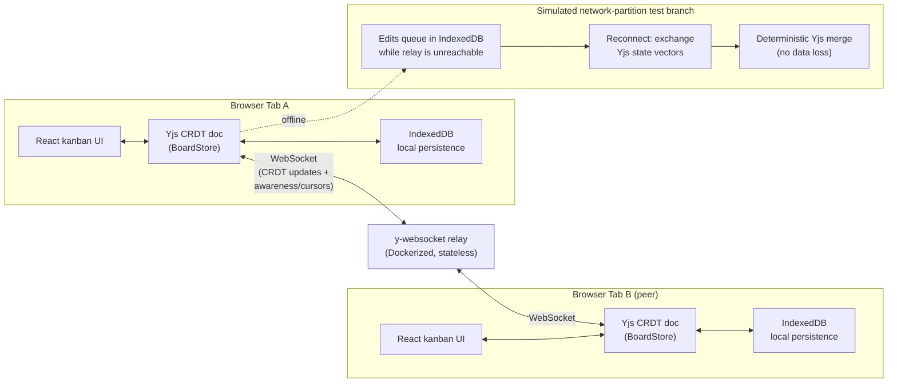

# SyncBoard

**A kanban board that never loses an edit - even when the network doesn't cooperate.**


## The real problem

Distributed teams run their day-to-day work through tools like Trello and Linear over connections that are flaky by nature - spotty office wifi, tunnels, transatlantic flights, a laptop that sleeps mid-edit. Most of those tools handle a dropped connection in one of two bad ways: they silently lose the edits you made while offline, or they resolve conflicts with last-write-wins, which quietly throws away a teammate's change the instant two people touch the same card while partitioned from each other.

Teams building their own internal tools or B2B SaaS need a proven pattern for real-time collaboration that survives this - not a toy demo, something that can actually be defended in a design review: what happens when two users edit the same card while both are offline, and then both come back online at the same time?

SyncBoard is a working answer to that question: a drag-and-drop kanban board with live multi-user cursors and full offline support, where **Yjs CRDTs**, not hand-rolled merge logic, guarantee that concurrent edits converge deterministically and nothing is ever silently dropped.

> **Attribution note:** the conflict-free merging in this project is done by [Yjs](https://docs.yjs.dev/), a mature, widely-used CRDT library - this project does not implement its own CRDT algorithm. The engineering work here, and the part worth discussing, is the **sync/offline/partition wiring around Yjs**: the document schema design (why cards use Y.Text for titles, why column membership is derived from a single source-of-truth field instead of trusted from an array), the IndexedDB-backed offline queue, the browser-online-aware reconnect state machine, the awareness-based live cursors, and the conflict-resolution test suite that proves the no-data-loss property under a simulated split-brain. Understanding Yjs's update model (binary CRDT deltas + state-vector diffing) and its awareness protocol (ephemeral, never-persisted presence state) well enough to wire all of that together correctly is the actual skill being demonstrated.

## Architecture



The offline -> reconnect -> merge path, concretely:

1. **Offline queue.** Every local edit (add card, move card, edit title) is applied to the in-memory Y.Doc immediately and persisted to IndexedDB on the same tick via y-indexeddb. There is no separate "outbox" table - the persisted CRDT document is the queue. This works with zero network reachability at all.
2. **Reconnect.** When the y-websocket WebsocketProvider (re)connects to the relay, the Yjs sync protocol exchanges compact state vectors with peers and each side sends only the updates the other is missing - not the whole document.
3. **Deterministic merge.** Yjs applies the incoming updates to the local document. Map writes resolve by (logical clock, client ID), not wall-clock time; array inserts/deletes are position-aware; Y.Text edits merge character-by-character. The src/store/__tests__/partition.test.ts suite proves this directly by running two Y.Doc replicas with zero network between them, mutating both concurrently, then merging and asserting both converge to one identical, complete state.

## Quick start

Requires Node 22+.

```bash
npm install

# terminal 1: the relay
npm run dev:relay          # ws://localhost:1234

# terminal 2: the app
npm run dev                # http://localhost:5173

# open two browser tabs to see live cursors + real-time sync:
#   http://localhost:5173/?board=demo
#   http://localhost:5173/?board=demo   (in a second tab/incognito window)
```

Click **"Simulate network partition"** in the header of either tab to disconnect just that tab (via the app's own connection manager, independent of your real network) - edit the board while it's "offline", then click **"Simulate reconnect"** and watch the edits merge into the other tab with zero data loss.

### Testing

```bash
npm test          # Vitest unit + conflict-resolution suite (no network, no Docker)
npm run build     # tsc --noEmit + production build
npm run e2e       # Playwright E2E - needs `npx playwright install chromium`
                  # and spins up a real relay + real dev server (see playwright.config.ts)
```

### Running the relay in Docker

```bash
docker compose up --build
# or directly:
docker build -t syncboard-relay .
docker run -p 1234:1234 syncboard-relay
```

## How it works

### Document schema (src/store/boardStore.ts)

```
Y.Doc
|-- getMap('columns')  columnId -> Y.Map { id, title, order, cardIds: Y.Array<string> }
|__ getMap('cards')    cardId   -> Y.Map { id, columnId, title: Y.Text, description: Y.Text, createdAt, updatedAt }
```

cardIds arrays are treated as an **ordering hint**, not the source of truth for column membership - card.columnId is. This is the one non-obvious design decision in the whole project, and it exists to fix a real bug I hit while building this: if two replicas concurrently move the same card into two different columns while partitioned, each removes the card from the shared source array (fine, that converges) but inserts it into its own destination array - two different Y.Array instances, so both inserts survive independently. Without a fix, the card would render inside two columns at once after the merge, even though columnId itself already resolved to one deterministic winner. BoardStore.getSnapshot() reconciles this at read time: each column's rendered card list is filtered to cards whose columnId actually points at it, with strays re-attached to whichever column they legitimately belong to. See the "resolves a concurrent move-to-two-different-columns split-brain" test for the regression case.

### Offline-first persistence (src/store/persistence.ts)

Wraps y-indexeddb. Unit-tested against fake-indexeddb (a full in-memory IndexedDB implementation) so the real persistence code path - not a mock of it - runs in CI with no browser and no network.

### Connection state machine (src/lib/connectionManager.ts)

y-websocket's WebsocketProvider only knows about the socket; it will happily keep retrying with exponential backoff even after the OS has told the browser there's no network at all. ConnectionManager layers navigator.onLine/online/offline events on top: the instant the browser reports no network it force-disconnects the provider and reports a distinct offline status (vs. disconnected, a live retry-in-progress state); the instant the network returns it reconnects immediately rather than waiting out a backoff timer. It's built against a small SyncProvider interface so the whole state machine is unit-tested with a fake transport - no real socket required.

### Live cursors (src/hooks/useCursorBroadcast.ts, src/components/Cursors.tsx)

Built on Yjs **awareness** (y-protocols/awareness, wired in via y-websocket), which is deliberately a separate channel from the CRDT document: awareness state (cursor position, presence) is ephemeral and re-broadcast on connect, never persisted and never merged into document history - exactly the semantics you want for "is this person still here" instead of "what did they type."

### Drag-and-drop kanban UI (src/components/)

Native HTML5 drag-and-drop (no DnD dependency) driving BoardStore.moveCard, so every drag operation is a real CRDT mutation, replicated and persisted the same way a typed edit is.

## Project structure

```
src/
  types.ts                    shared TS types (snapshots, awareness state)
  store/
    boardStore.ts              Yjs document schema + mutation API
    persistence.ts              IndexedDB (y-indexeddb) wrapper
    connection.ts                relay wiring (WebsocketProvider + awareness)
    __tests__/
      boardStore.test.ts        CRUD behavior of the schema
      partition.test.ts          conflict-resolution / split-brain suite (the core proof)
      persistence.test.ts        IndexedDB durability, using fake-indexeddb
  lib/
    textDelta.ts                 minimal-diff binder for plain strings <-> Y.Text
    connectionManager.ts         online/offline/reconnect state machine
    __tests__/                   unit tests for both, no network/browser required
  hooks/
    useBoard.ts                  assembles doc + persistence + relay + awareness
    useCursorBroadcast.ts        throttled mouse -> awareness broadcaster
  components/                    Board, Column, CardItem, Cursors, ConnectionBanner
  server/
    relay.ts                     the y-websocket relay (Dockerized)
e2e/
  offline-online.spec.ts         real two-browser-context partition/reconnect proof
```

## Known limitations (honest, not hidden)

- **Field-level edits are last-writer-wins**, deterministically ordered by Yjs, not merged semantically. Concurrent edits to the same character range of a title (rather than different ranges) resolve to one winner - Yjs guarantees both replicas agree on which one, but it doesn't invent a merge of "delete this word" vs. "change this word" the way a human would.
- **Deleting a column that another replica is concurrently adding a card into** leaves that card as an orphan (present in the cards map, not attached to any surviving column) rather than silently deleting it or resurrecting the column. This is a deliberate, tested trade-off - see partition.test.ts - favoring "never silently lose a user's card" over automatic column resurrection.
- The relay holds no board data at rest; it is a pure message relay. Long-term storage of a board that no client has open would need a persistence-enabled relay (Yjs supports this via y-leveldb/y-redis persistence adapters) - out of scope here by design, since every client already persists its own full copy.

## Maintainer

**Rushi Kiran Adiboina**
Full Stack Developer

Rushi is a Full Stack Developer with over 6 years of experience designing and developing scalable enterprise applications. He specializes in React.js, TypeScript, and distributed systems, with a focus on building resilient frontend architectures and event-driven backend services.

- **Email:** rushikiranadiboina@gmail.com
- **LinkedIn:** https://www.linkedin.com/in/rushi-adiboina/
- **Key Expertise:** React, Redux, Node.js, Java, Spring Boot, CRDTs, and Cloud Infrastructure.